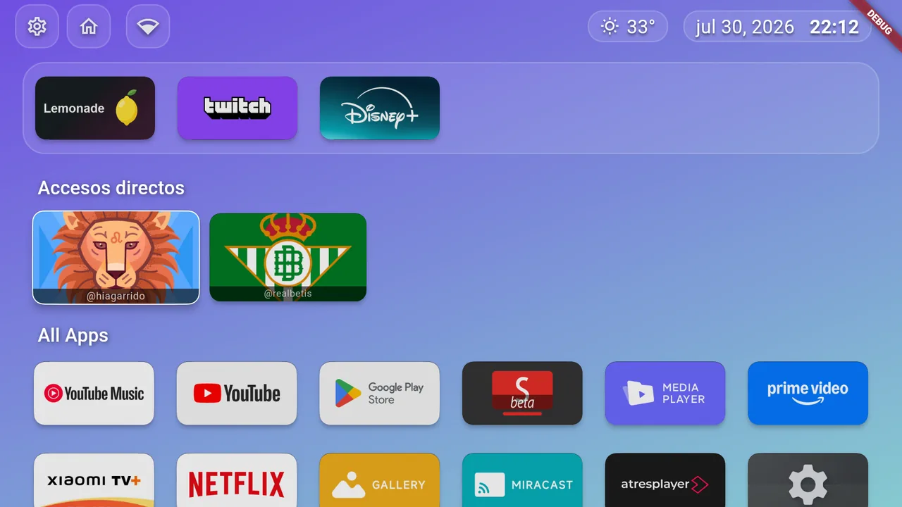
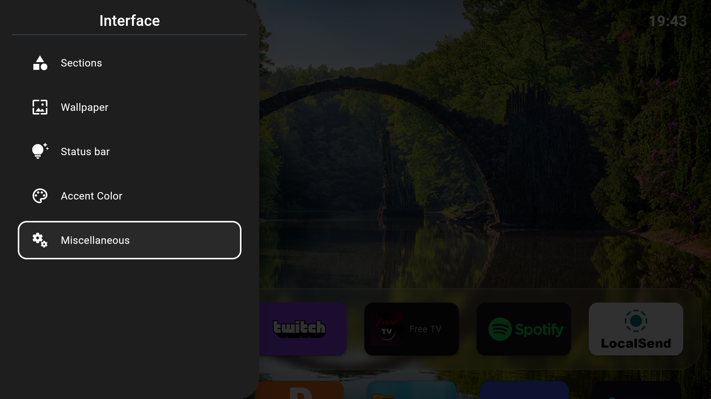
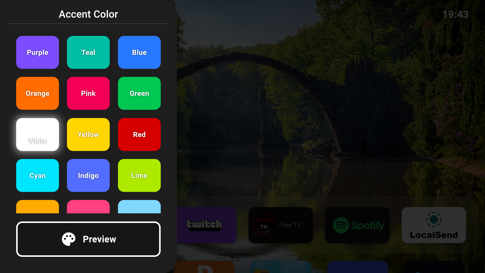
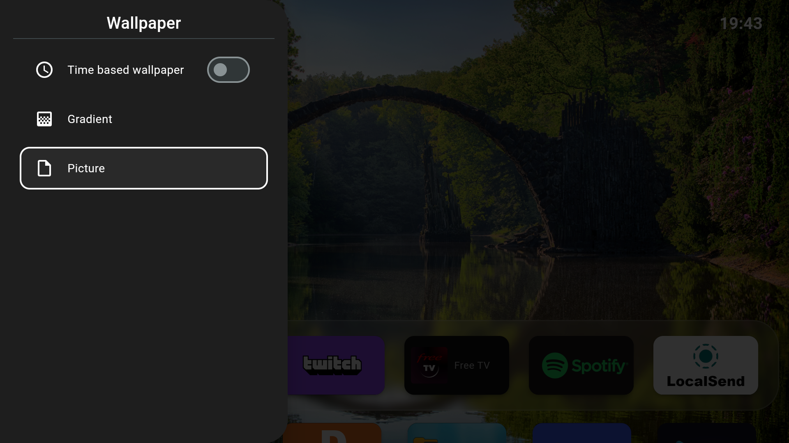
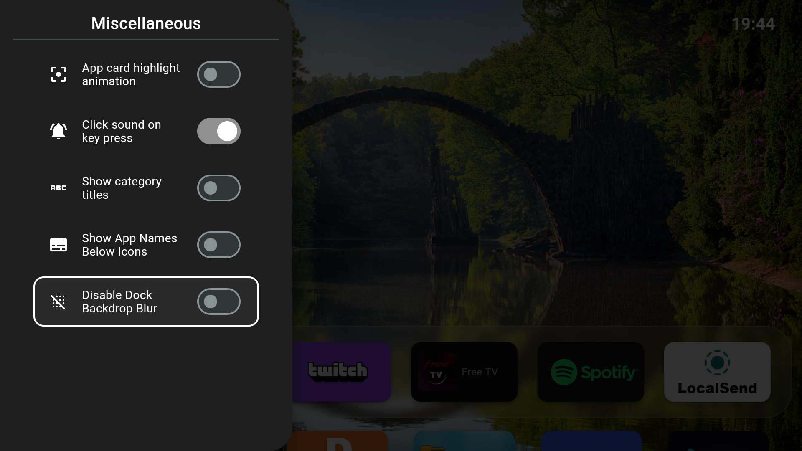
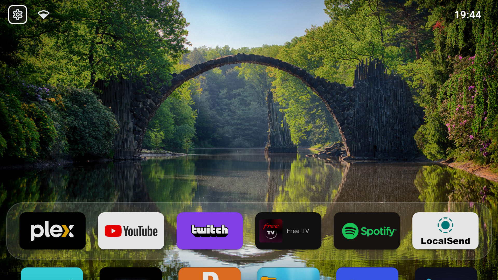
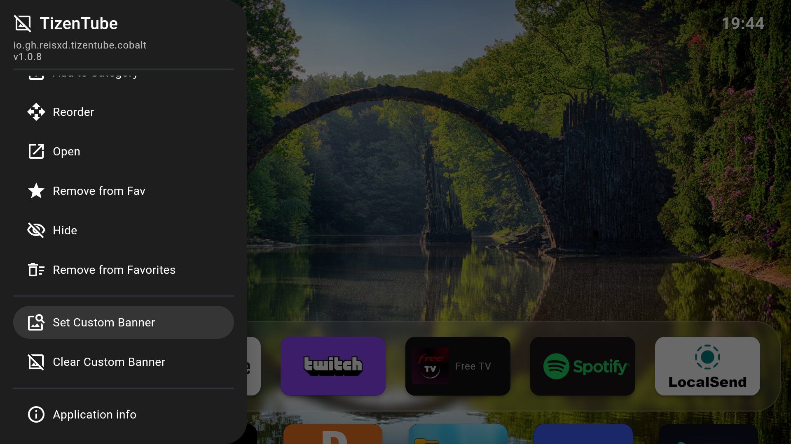
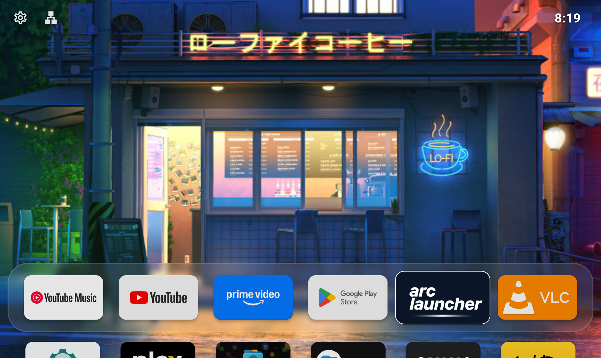
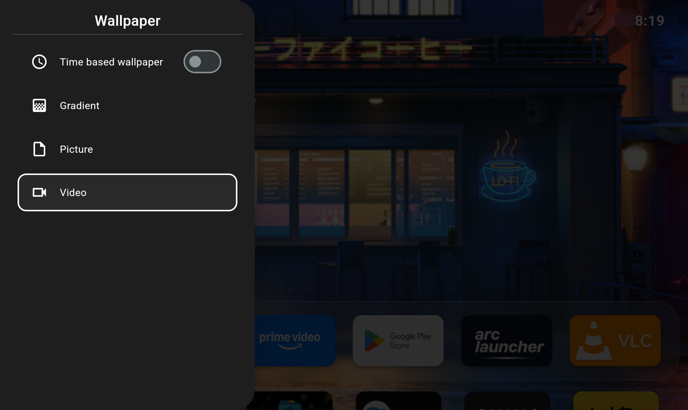
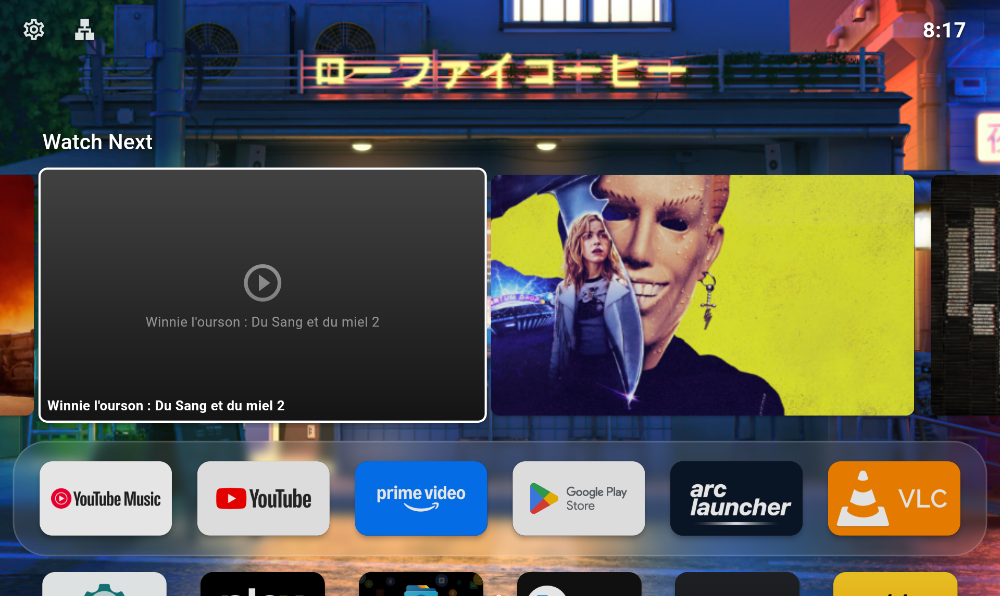

# Lemonade Launcher

<picture>
  
</picture>

**Lemonade Launcher** es un launcher alternativo de código abierto para Android TV, centrado en un diseño minimalista y premium: un dock inferior con efecto cristal, el centro de la pantalla despejado para el fondo y navegación íntegra con la cruceta del mando.

Es un fork de [Arc Launcher](https://github.com/meddouribadis/arclauncher), que a su vez deriva de [LTvLauncher](https://github.com/LeanBitLab/LtvLauncher) y del proyecto original [FLauncher](https://gitlab.com/flauncher/flauncher) de [etienn01](https://github.com/etienn01).

- **Dispositivo de referencia:** Xiaomi TV Box S (3.ª generación, Google TV)
- **Idioma por defecto:** español de España (respeta el idioma del sistema si está entre los admitidos)
- **Stack:** Flutter (Dart) con código nativo en Java para la integración con Android TV

## Características

- **Dock inferior** — Una única fila de aplicaciones favoritas anclada abajo, con fondo de cristal esmerilado (*glassmorphism*), y el centro de la pantalla libre para el fondo.
- **Nombres bajo demanda** — El nombre de la aplicación permanece oculto y solo aparece bajo el icono que tiene el foco.
- **Fondo de pantalla flexible** — Imagen, vídeo animado, degradados, y cambio automático entre fondo de día y de noche.
- **Sección «Continuar viendo»** — Fila superior con el contenido que dejaste a medias en tus aplicaciones de streaming, leída del propio sistema Android TV.
- **Widget de consumo de datos** — Consumo diario de Internet directamente en la barra superior.
- **Salvapantallas OLED** — Reloj minimalista que se desplaza cada 30 s para prevenir el quemado del panel.
- **Acceso rápido al Wi-Fi** — El indicador de red funciona como atajo a los ajustes de red del sistema.
- **Indicador de foco reforzado** — Doble borde que garantiza visibilidad sobre cualquier fondo.
- **Color de acento configurable** — Varios preajustes para personalizar la interfaz.
- **Categorías personalizables** — Crea, renombra y reordena categorías; alterna entre vista de fila y de rejilla.
- **Soporte de apps no-TV** — Las aplicaciones de móvil instaladas por *sideload* aparecen junto a las nativas de TV.
- **Programador de brillo (experimental)** — Ajusta el brillo del sistema según la hora. Requiere el permiso `WRITE_SETTINGS` vía ADB.
- **Sin anuncios ni telemetría.**

> [!WARNING]
> **El programador de brillo es experimental.** No está probado en todos los dispositivos y puede cambiar o desaparecer en versiones futuras.

> [!TIP]
> **Rendimiento del fondo de vídeo:** combinar fondo de vídeo con el filtro de desenfoque activado puede provocar tirones en dispositivos de gama baja. Si notas parones, desactiva el filtro de desenfoque en los ajustes.

> [!TIP]
> **Tamaño del fichero de vídeo:** los fondos de vídeo se cargan en RAM. Usa ficheros pequeños y comprimidos (idealmente por debajo de 10 MB) en lugar de vídeos de bitrate alto.

## Capturas de pantalla

<table>
  <tr>
    <td align="center">Panel de ajustes</td>
    <td align="center">Colores de acento</td>
    <td align="center">Varios fondos</td>
  </tr>
  <tr>
    <td></td>
    <td></td>
    <td></td>
  </tr>
  <tr>
    <td align="center">Desactivar desenfoque</td>
    <td align="center">Desenfoque desactivado</td>
    <td align="center">Banner personalizado</td>
  </tr>
  <tr>
    <td></td>
    <td></td>
    <td></td>
  </tr>
  <tr>
    <td align="center">Pantalla de inicio</td>
    <td align="center">Opciones de fondo</td>
    <td align="center">Continuar viendo</td>
  </tr>
  <tr>
    <td></td>
    <td></td>
    <td></td>
  </tr>
</table>

## Compilar el proyecto

Requiere el SDK de Flutter indicado en `pubspec.yaml`.

```shell
# Instalar dependencias
$ flutter pub get

# Generar el código de Drift y las localizaciones
$ dart run build_runner build --delete-conflicting-outputs

# Compilar el APK
$ flutter build apk --release
```

### Autoactualizador (opcional)

El launcher puede buscar sus propias actualizaciones en las *releases* de un repositorio de GitHub. Viene **desactivado**, y solo se activa si se le indica el repositorio en tiempo de compilación:

```shell
$ flutter build apk --release --flavor github \
    --dart-define=ENABLE_SELF_UPDATER=true \
    --dart-define=UPDATE_REPO_OWNER=tu-usuario \
    --dart-define=UPDATE_REPO_NAME=lemonade-launcher
```

Si falta cualquiera de los dos `dart-define`, la opción «Buscar actualizaciones» no aparece en los ajustes. Es intencionado: evita que una compilación mal configurada ofrezca el APK de otro proyecto.

Para que una publicación sea detectada, la *release* de GitHub debe cumplir:

| Requisito | Detalle |
| --- | --- |
| Etiqueta | Versión semántica, con o sin `v`: `v1.0.7` o `1.0.7`. Se compara numéricamente con la `version` de `pubspec.yaml` |
| Estado | Ni borrador ni *prerelease*: ambos se ignoran |
| Adjunto | Al menos un `.apk`. Se prefiere el universal (`lemonade-launcher-1.0.7.apk`); los específicos por ABI (`-arm64-v8a.apk`) sirven de respaldo |

El flavor `github` es necesario porque es el único que declara el permiso `REQUEST_INSTALL_PACKAGES`. Además, Android exige autorizar «instalar apps desconocidas» para el launcher la primera vez.

## Establecer Lemonade Launcher como launcher predeterminado

### Método 1: reasignar el botón Inicio

Es la vía más segura y sencilla. Usa [Button Mapper](https://play.google.com/store/apps/details?id=flar2.homebutton) para reasignar el botón Inicio del mando y que abra Lemonade Launcher.

### Método 2: desactivar el launcher nativo

> [!CAUTION]
> **Lo haces bajo tu propia responsabilidad.** Cualquier fallo de funcionamiento en el dispositivo es responsabilidad de quien ejecuta estos comandos.

Una vez desactivado el launcher predeterminado, pulsa el botón Inicio del mando y el sistema te preguntará qué aplicación quieres usar como predeterminada.

Los comandos siguientes se han probado en Chromecast con Google TV. En otros dispositivos el nombre del paquete puede variar.

#### Desactivar el launcher nativo

```shell
# Desactiva com.google.android.apps.tv.launcherx, el launcher nativo en CCwGTV
$ adb shell pm disable-user --user 0 com.google.android.apps.tv.launcherx
# com.google.android.tungsten.setupwraith actúa como respaldo y volvería a activar
# el launcher nativo, así que hay que desactivarlo también
$ adb shell pm disable-user --user 0 com.google.android.tungsten.setupwraith
```

#### Volver a activar el launcher nativo

```shell
$ adb shell pm enable com.google.android.apps.tv.launcherx
$ adb shell pm enable com.google.android.tungsten.setupwraith
```

#### Problemas conocidos

En Chromecast con Google TV (y posiblemente en otros dispositivos), el botón «YouTube» del mando deja de funcionar cuando se desactiva el launcher nativo. Como solución, puedes reasignarlo con [Button Mapper](https://play.google.com/store/apps/details?id=flar2.homebutton).

## Fondo de pantalla

Como `WallpaperManager` de Android no está disponible en algunos dispositivos Android TV, el launcher implementa su propia gestión de fondos.

Ten en cuenta que cambiar el fondo requiere tener instalado un explorador de archivos en el dispositivo para poder seleccionar el fichero.

## Licencia

GNU General Public License v3.0. Consulta el fichero [LICENSE](LICENSE).

## Créditos

Este proyecto no existiría sin el trabajo previo de:

- **[FLauncher](https://gitlab.com/flauncher/flauncher)** de [etienn01](https://github.com/etienn01) — el proyecto original
- **[FLauncher (fork)](https://github.com/osrosal/flauncher)** de [osrosal](https://github.com/osrosal) — fork comunitario con funcionalidades añadidas
- **[LTvLauncher](https://github.com/LeanBitLab/LtvLauncher)** de [LeanBitLab](https://github.com/LeanBitLab)
- **[Arc Launcher](https://github.com/meddouribadis/arclauncher)** de [meddouribadis](https://github.com/meddouribadis) — base directa de este fork
