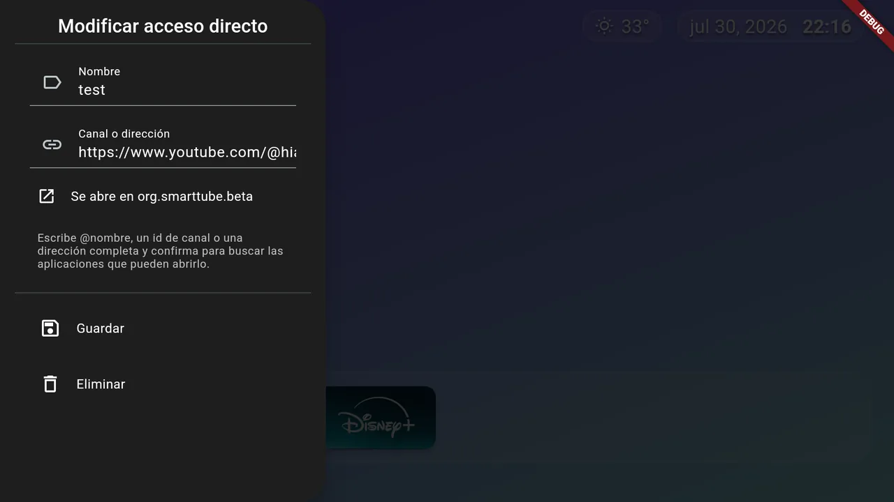
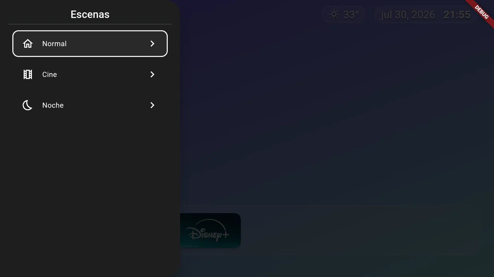
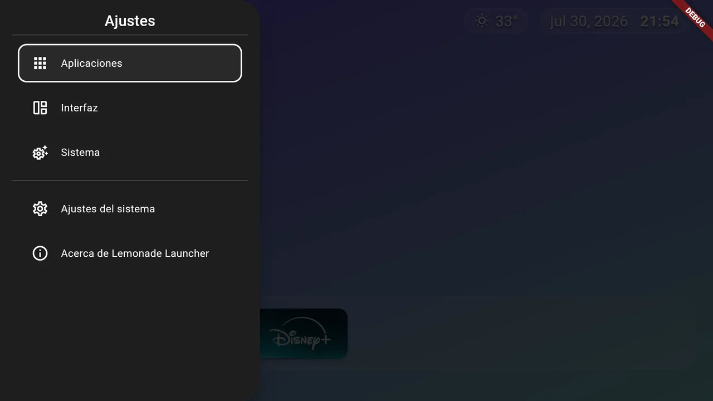
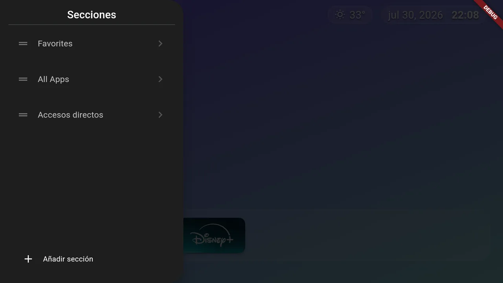
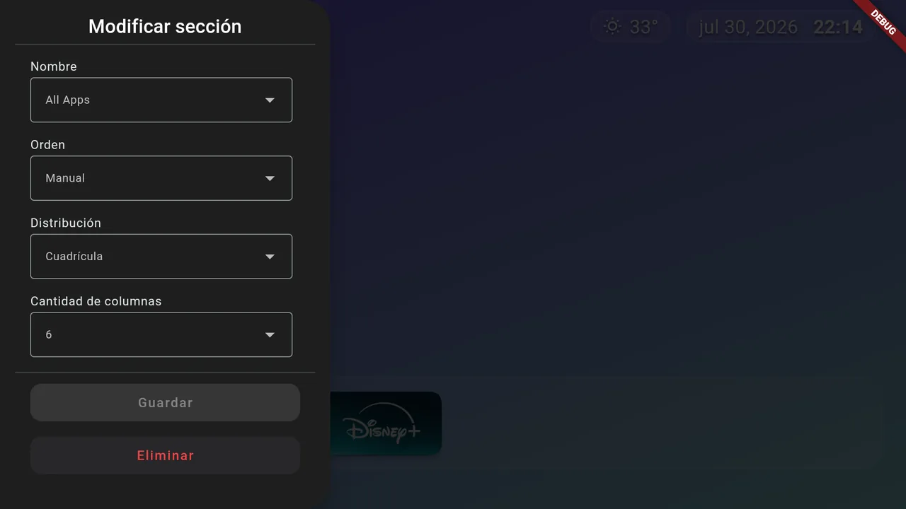
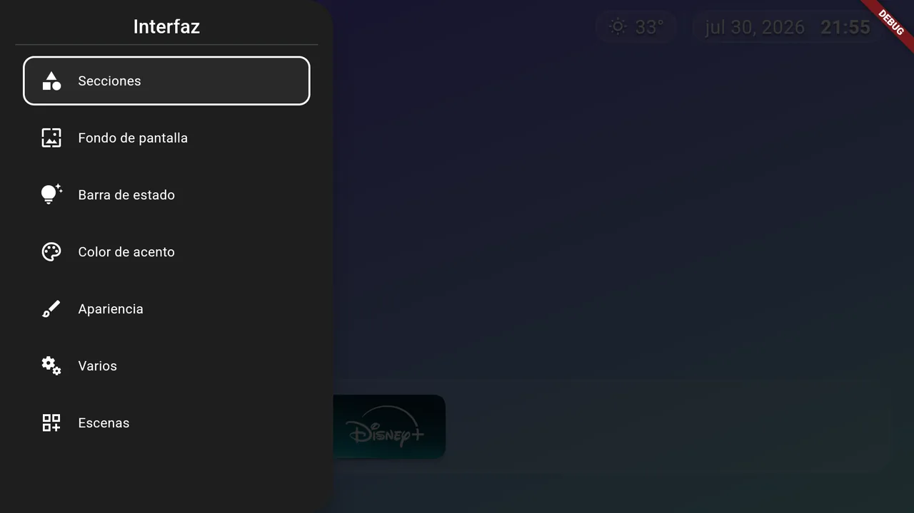
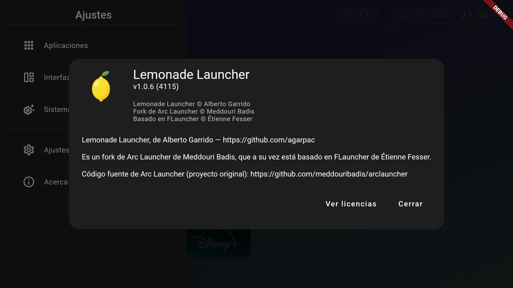

# Lemonade Launcher

<picture>
  
</picture>

**Lemonade Launcher** es un launcher de código abierto para Android TV, pensado para una pantalla de inicio que no estorba: el centro despejado para el fondo, un dock inferior con cristal esmerilado, y todo navegable con la cruceta del mando sin un solo menú escondido.

Lo mantiene [Alberto Garrido](https://github.com/agarpac). Es un fork de [Arc Launcher](https://github.com/meddouribadis/arclauncher), que a su vez deriva de [LTvLauncher](https://github.com/LeanBitLab/LtvLauncher) y del proyecto original [FLauncher](https://gitlab.com/flauncher/flauncher).

- **Dispositivo de referencia:** Xiaomi TV Box S de 3.ª generación (Google TV)
- **Idioma por defecto:** español de España, y respeta el idioma del sistema si está entre los admitidos
- **Stack:** Flutter (Dart) con código nativo en Java para la integración con Android TV
- **Sin anuncios, sin telemetría, sin cuentas**

## Qué trae

### Accesos directos a canales

Un icono que no abre una aplicación, sino **un canal concreto dentro de ella**. Escribes `@nombre` con el mando —o pegas una dirección completa— y el launcher pregunta al sistema **qué aplicaciones declaran públicamente que pueden abrir ese enlace**, para que elijas. No hay ningún paquete escrito a mano en el código, así que funciona con la aplicación que tengas instalada y no con la que alguien supuso.

La foto del canal se descarga sola al guardar, y si no se puede, la tarjeta se queda con su icono y nadie te muestra un error que no puedes arreglar.



### Escenas

Un paquete de ajustes de presentación que se cambian de golpe: fondo y seis ajustes de aspecto. **Se activan solo a mano**, nunca por horario ni por heurística, para que sepas con qué te vas a encontrar al encender la tele. La superposición no se escribe en tus ajustes: es una lectura sobre ellos, así que salir de una escena te devuelve exactamente lo que tenías.



### Clima

Temperatura y estado del cielo en la barra superior, con **Open-Meteo**: sin clave de API, sin registro y sin cuenta. La ciudad se elige buscándola por nombre, nunca por GPS ni por IP. Si no hay red, el bloque desaparece en silencio en lugar de plantarte un error en la pantalla de inicio.

### Copia de seguridad y restauración

Un único fichero JSON con tus ajustes, tus categorías y su orden, guardado en el almacenamiento externo de la app para que lo puedas sacar con `adb pull` o con un gestor de ficheros. Al restaurar te dice qué aplicaciones ya no están instaladas y qué fondos tendrás que volver a elegir, en lugar de dejarte entradas que no abren nada.

### Barra superior y dock

Cada elemento de la barra va en su propia tarjeta de cristal, con una sola definición compartida para que no se desalineen. Los iconos usan **squircle** (superelipse, la forma de iOS) en vez de esquinas redondeadas: la curvatura es continua y no se rompe al llegar al lado recto.



### Secciones a tu gusto

Categorías y accesos directos son secciones, y las colocas en el orden que quieras. Cada una elige su distribución —fila o cuadrícula—, su altura y su número de columnas.

<table>
  <tr>
    <td align="center">Secciones</td>
    <td align="center">Editor de una sección</td>
    <td align="center">Interfaz</td>
  </tr>
  <tr>
    <td></td>
    <td></td>
    <td></td>
  </tr>
</table>

### Y lo que ya traía la base

- **Fondo de pantalla** — imagen, vídeo, degradados, y conmutación automática entre día y noche. Se elige de la galería del propio dispositivo.
- **«Continuar viendo»** — el contenido que dejaste a medias en tus apps de streaming, leído del propio sistema Android TV y no de ninguna API externa.
- **Consumo diario de datos** en la barra superior.
- **Indicador de red** que funciona como atajo a los ajustes de Wi-Fi.
- **Salvapantallas** de reloj que se desplaza, para pantallas sensibles al quemado.
- **Color de acento** configurable, que alimenta el tema completo.
- **Aplicaciones de móvil** instaladas por *sideload*, junto a las nativas de TV.
- **Programador de brillo (experimental).** Requiere conceder `WRITE_SETTINGS` por ADB.

> [!WARNING]
> **El programador de brillo es experimental y en muchos montajes no hace nada.** Si el launcher corre en una caja HDMI, los ajustes de brillo de Android no controlan el panel del televisor.

> [!TIP]
> **Fondos de vídeo:** se cargan en RAM y el desenfoque a pantalla completa cuesta caro en GPU de gama baja. Usa ficheros pequeños, y si notas tirones desactiva el filtro de desenfoque en los ajustes.

## Instalación

Descarga el APK de la [última release](https://github.com/agarpac/lemonade-launcher/releases). Es **universal**: lleva las tres arquitecturas, pesa unos 60 MB y funciona en cualquier dispositivo.

Solo hay un APK a propósito: la compilación por arquitectura se quitó del proyecto. El motivo está en `docs/PRD.md`, sección 13.9: Flutter les asigna un `versionCode` más alto que al universal, Android rechaza actualizar a un código menor, y eso dejaría sin actualizaciones justo a quien eligiera la descarga pequeña.

Si alguna vez la reintroduces, un aviso: **no deduzcas la arquitectura del dispositivo por su modelo**. Muchas cajas de Android TV llevan un chip de 64 bits y un espacio de usuario de 32, así que un APK de `arm64-v8a` falla en ellas con `INSTALL_FAILED_NO_MATCHING_ABIS`. La comprobación fiable es `adb shell getprop ro.product.cpu.abilist`.

Android pedirá autorizar «instalar aplicaciones desconocidas» la primera vez.

## Compilar

Requiere la versión de Flutter que fija `pubspec.yaml`. El proyecto la fija además en `mise.toml`, así que con [mise](https://mise.jdx.dev/) instalado no hace falta gestionar versiones a mano.

```shell
# Dependencias
$ flutter pub get

# Código generado (Drift y localizaciones)
$ dart run build_runner build --delete-conflicting-outputs

# APK
$ flutter build apk --release --flavor github
```

**El flavor es obligatorio.** Hay dos, `play` y `github`, y solo `github` declara el permiso `REQUEST_INSTALL_PACKAGES` que necesita el autoactualizador.

Firmar una release necesita un keystore propio, referenciado desde `android/local.properties` (que está fuera del control de versiones):

```
storeFile=upload-keystore.jks
storePassword=...
keyAlias=...
keyPassword=...
```

## Autoactualizador

El launcher puede buscar sus propias actualizaciones en las *releases* de un repositorio de GitHub. Viene **desactivado** y solo se activa si se le dice cuál en tiempo de compilación:

```shell
$ flutter build apk --release --flavor github \
    --dart-define=ENABLE_SELF_UPDATER=true \
    --dart-define=UPDATE_REPO_OWNER=agarpac \
    --dart-define=UPDATE_REPO_NAME=lemonade-launcher
```

Si falta cualquiera de los dos, la opción «Buscar actualizaciones» no aparece en los ajustes. Es intencionado: evita que una compilación mal configurada ofrezca el APK de otro proyecto.

La comprobación es **manual**: un botón en Ajustes, sin avisos automáticos ni consultas al arrancar. Para que una publicación se detecte, la release debe cumplir:

| Requisito | Detalle |
| --- | --- |
| Etiqueta | Versión semántica, con o sin `v`. Se compara numéricamente con la `version` de `pubspec.yaml` |
| Estado | Ni borrador ni *prerelease*: ambos se ignoran |
| Adjunto | Al menos un `.apk`. Se prefiere el universal; los específicos por ABI sirven de respaldo |

Android exige además autorizar «instalar apps desconocidas» para el launcher la primera vez. Una app instalada por *sideload* no puede instalar nada en silencio.

## Ponerlo como launcher predeterminado

### Opción 1: reasignar el botón Inicio

La vía segura. Con [Button Mapper](https://play.google.com/store/apps/details?id=flar2.homebutton) reasignas el botón Inicio del mando para que abra Lemonade Launcher, y el launcher del sistema sigue intacto.

### Opción 2: desactivar el launcher del sistema

> [!CAUTION]
> **Bajo tu responsabilidad.** Si desactivas el launcher del sistema y el sustituto no arranca, el televisor se queda sin pantalla de inicio y recuperarla exige un ordenador y un cable.

```shell
# Desactivar (los nombres de paquete varían según el dispositivo)
$ adb shell pm disable-user --user 0 com.google.android.apps.tv.launcherx
# Este otro lo reactivaría, así que también hay que desactivarlo
$ adb shell pm disable-user --user 0 com.google.android.tungsten.setupwraith

# Volver atrás
$ adb shell pm enable com.google.android.apps.tv.launcherx
$ adb shell pm enable com.google.android.tungsten.setupwraith
```

En algunos dispositivos el botón «YouTube» del mando deja de funcionar al desactivar el launcher del sistema. Se puede reasignar con Button Mapper.

## Licencia y créditos

GNU General Public License v3.0 — ver [LICENSE](LICENSE).



Este proyecto no existiría sin el trabajo previo de:

- **[FLauncher](https://gitlab.com/flauncher/flauncher)** de [etienn01](https://github.com/etienn01) — el proyecto original
- **[FLauncher (fork)](https://github.com/osrosal/flauncher)** de [osrosal](https://github.com/osrosal) — fork comunitario con funcionalidades añadidas
- **[LTvLauncher](https://github.com/LeanBitLab/LtvLauncher)** de [LeanBitLab](https://github.com/LeanBitLab)
- **[Arc Launcher](https://github.com/meddouribadis/arclauncher)** de [meddouribadis](https://github.com/meddouribadis) — base directa de este fork

La cadena de atribución no es cortesía: la licencia obliga a mantenerla, y por eso aparece también en el diálogo «Acerca de» de la propia aplicación.
